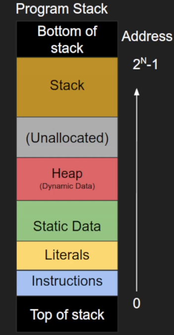

# debug

## useful command

清屏

或者 Ctrl+L

```shell
!clear
```

开始调试

```shell
start
```

列出源码

```shell
list
```

执行下一行代码 不进入函数

```shell
next
```

执行下n行代码

```shell
next n
```

在函数处添加断电

```shell
b fun_name
```

查看断点信息

```shell
info breakpoints
```

运行代码

```shell
r
run
```

显示源代码窗口

```shell
layout src
```

显示调用栈

```shell
bt
```

运行完当前函数并返回到调用该函数的地方

```shell
finish
```

逐步执行代码，进入函数调用内部进行调试

```shell
s
step
```

重新绘制当前的 TUI（文本用户界面）窗口

```shell
refresh
```

继续运行程序，直到下一个断点、异常、或程序结束

```shell
continue
```

删除断点

在使用 delete 命令之前，你可以使用 info breakpoints 命令查看所有断点的编号

```shell
(gdb) delete num
```

显示当前程序中所有线程的信息

```shell
info threads
```

打印变量 a 的当前值

```shell
print a
```

显示变量 a 的类型

```shell
whatis a
```

gdb --tui --silent your_program

--tui：启用文本用户界面（TUI，Text User Interface）模式
--silent：启用静默模式，即启动时不显示 gdb 的版本信息、版权信息和欢迎消息

显示当前函数中所有局部变量的值

```shell
info locals
```

自动显示指定表达式或变量的值，对于调试过程中持续监视某些变量的变化非常有用。

```shell
display <表达式>
```

Valgrind 是一个非常强大的程序分析工具，主要用于内存泄漏检测和调试内存管理问题。它能够帮助开发者检测 C、C++ 以及其他使用动态内存分配的程序中常见的错误，如内存泄漏、非法内存访问和未初始化内存的使用等。

分析

```shell
valgrind ./main
```

检测程序 main 中的内存泄漏问题的命令。

```shell
valgrind --leak-check=full ./main
```

indent

在编程中，indent 是一个 Unix 工具，主要用于格式化 C、C++ 代码。它能够将代码格式化为一致的缩进风格，增强代码的可读性，确保不同的代码块在缩进和排版上统一。

```shell
indent filename
indent -gnu filename
indent -kr filename
indent -bsd filename
```

查看gdb版本

```shell
gdb --version
```

lldb

LLDB 是一个调试器，与 gdb 类似，用于调试程序。LLDB 是由苹果公司开发的，并且作为 LLVM 项目的一部分维护。它支持 C、C++、Objective-C 和 Swift 等多种编程语言。LLDB 提供了强大的调试功能，包括断点设置、单步调试、查看内存、变量值等，与 gdb 类似，适合调试大型和复杂项目。

退出

```shell
q
```

编译时

- 在程序运行之前
- 示例错误
  - 语法相关错误
  - 缺失文件
  - 链接目标文件时的错误
- 可以使用 static_assert（C++11）捕获
- 编译器有时可以通过“警告”提示我们可能的错误
- 其他静态分析工具也可以保守地尝试预测并报告错误

运行时

当程序运行时

- 示例错误
  - 内存泄漏
  - 段错误（Segmentation Faults）
  - 性能相关错误
- 可以通过异常捕获和处理
- 可以通过 assert 捕获

编译器根据语言语法解析我们的代码

启用所有常见的编译器警告

```shell
gcc -Wall main.c -o prog 
```

比较数值是否相等写为：

```c++
7 == x
```

检测和报告在类型转换过程中可能出现的问题或潜在错误。

```shell
-Wconversion
```

将所有警告视为错误

```shell
-Werror
```

可以对用不同的编译器对一个程序进行检查

printf debugging

```c++
#define DEBUG 1

#if DEBUG
    printf("a = %d",a);
#endif
```

停用

```c++
#define DEBUG 1
#undef DEBUG

#if DEBUG
    printf("a = %d",a);
#endif
```

或者

```c++
#if DEBUG
    printf("a = %d",a);
#endif
```

在编译的时候加入

```shell
gcc -DDEBUG swap_buggy.c -o prog
```

编译程序时生成调试信息
在我们编译的代码中添加调试符号

- 文件名
- 行号
- 符号名

```shell
gcc -g
```

cmake中编译程序时生成调试信息

1. 使用 CMAKE_BUILD_TYPE 设置调试模式
  在 CMake 文件中设置编译类型为 Debug，CMake 会自动添加 -g 选项：
  
  ```cmake
  set(CMAKE_BUILD_TYPE Debug)
  ```

  然后，在构建项目时，确保使用以下命令生成调试信息：

  ```bash
  cmake -S . -B build -DCMAKE_BUILD_TYPE=Debug
  cmake --build build
  ```

2. 手动添加编译选项
  可以直接在 CMakeLists.txt 中通过 CMAKE_CXX_FLAGS 或 CMAKE_C_FLAGS 来添加 -g 选项。

  ```cmake
  set(CMAKE_CXX_FLAGS "${CMAKE_CXX_FLAGS} -g")
  set(CMAKE_C_FLAGS "${CMAKE_C_FLAGS} -g")
  ```

3. 为特定的目标添加 -g
  如果你只想为某个特定的目标添加 -g 选项，可以使用 target_compile_options()：
  
  ```cmake
  add_executable(my_program main.cpp)
  target_compile_options(my_program PRIVATE -g)
  ```

关闭优化

gcc -O0 是 GCC 编译器的一个选项，用于关闭优化。当你编译代码时，编译器通常会进行不同程度的优化，以提高代码的执行效率。然而，优化有时会使得调试变得更加复杂，因为编译器可能会对代码进行重排或省略某些部分。在某些情况下，优化可能会隐藏一些调试信息。

设置在使用 list 命令时显示的源代码行数

```bash
set listsize <number>
```

显示源代码中指定行号附近的代码。

```bash
list <number>
```

打印变量、类型或表达式的类型信息

```bash
ptype <name>
```

显示指定函数或文件范围内的所有变量和函数

```bash
info scope <function_name>
info scope <filename>
```

列出程序中定义的所有类型

```bash
info types
```

设置一个临时断点

```bash
tbreak <location>
```

`<location>`：可以是函数名、行号或地址，指定你希望设置临时断点的位置。

设置断点

```bash
break <location>
```

`<location>`：可以是函数名、行号、地址，甚至是某些条件。它指定你希望设置断点的程序位置。

在TUI（文本用户界面）模式下显示寄存器窗口

```bash
layout regs
```

这个窗口会显示当前所有 CPU 寄存器的内容，帮助开发者在调试时监视寄存器值的变化。

显示程序的汇编代码

```bash
layout asm
```

切换到汇编视图窗口，显示当前程序的汇编指令，而不是源代码。这对调试低级程序或深入了解程序执行的汇编层细节非常有用。

在 TUI（Text User Interface，文本用户界面）模式下切换和控制当前活动窗口的焦点。

```bash
focus <window>
```

- focus src：将焦点切换到源代码窗口。
- focus asm：将焦点切换到汇编代码窗口。
- focus regs：将焦点切换到寄存器窗口。
- focus next：将焦点切换到下一个窗口，按顺序循环。

调整 TUI 模式下窗口的高度

```bash
winheight <window> <height>
```

- <window>：指定要调整的窗口，常用的有 src（源代码窗口）、asm（汇编窗口）、regs（寄存器窗口）等。
- <height>：设置窗口的高度（行数），即窗口显示的行数。

设置程序的输入/输出终端

```bash
$ tty
/dev/pts/4

(gdb) tty /dev/pts/4
```

输出到文件

```bash
(gdb) run > output.txt
```

添加条件断点

```bash
br 9 if i > 995
br 9 if i > 995 && i < 999
```

继续运行到指定的代码行或函数名

```bash
advance <location>
```

<location>：可以是行号、函数名、或文件中的行号。程序会继续运行到该位置并暂停。

让程序继续执行，直到到达当前循环结束或指定位置

```bash
until [<location>]
```

<location>：可选参数，可以是行号、函数名或文件中的行号。如果不指定，gdb 会继续执行程序，直到到达当前堆栈帧中的下一个行号（常用于跳过循环中的剩余代码）。

在 gdb 中，jump 命令用于立即跳转到指定的代码行或地址，并从该位置继续执行。与其他调试命令不同，jump 会改变程序的控制流，不执行中间的代码部分。它不会执行到达该行之前的代码，而是直接跳转到目标位置并从那里开始执行。

```bash
jump <location>
```

- <location>：可以是行号、函数名或内存地址，指定你希望跳转到的位置。该命令立即将控制流跳转到该位置。

主要使用场景：
- 跳过代码：当你在调试时，发现某些代码部分不需要执行，或者你想跳过一些中间的代码，可以使用 jump 直接跳到后面的代码继续执行。
- 跳回某段代码重新执行：如果你希望重新执行某些代码（如重新进入一个循环或条件语句），可以使用 jump 跳回到之前的位置，重复执行该部分代码。
- 跳过异常代码段：当程序因为某些错误无法继续运行时，使用 jump 跳过有问题的代码段，继续执行。

设置观察点

```bash
watch <expression>
```

<expression>：可以是一个变量或任意内存表达式。当该表达式的值发生变化时，程序会暂停。

设置一个只读观察点

```bash
rwatch <expression>
```

即当指定的变量或内存地址被读取时，程序会暂停执行。这与 watch 命令（用于监视变量的写操作）不同，rwatch 专注于监视变量的读取操作，帮助你调试程序中变量何时、如何被读取。

<expression>：可以是一个变量名或内存地址。当该变量或地址的内容被读取时，程序会暂停。

禁用断点、观察点或捕捉点

```bash
disable [breakpoints] [<number> ...]
disable watchpoints [<number> ...]
disable catchpoints [<number> ...]
```

- breakpoints：禁用指定的断点。可以通过编号指定某个断点，或者不指定编号时禁用所有断点。
- watchpoints：禁用指定的观察点。
- catchpoints：禁用指定的捕捉点。

将你当前设置的断点保存到一个文件中

```bash
save breakpoints <filename>
save breakpoints debugging_session_august.txt
```

加载保存的断点
可以在以后的调试会话中使用 source 命令从文件中恢复断点：

```bash
(gdb) source breakpoints.txt
```

自动显示指定表达式或变量的值
每当程序暂停时（例如遇到断点或单步执行时），gdb 会自动显示这些表达式的当前值。这个命令对于在调试过程中持续监视某些变量的变化非常有用。

```bash
display <expression>
```

- <expression>：你希望自动显示的变量或表达式。可以是简单的变量、数组、指针，甚至复杂的表达式。

停止显示：
如果你不再希望自动显示某个表达式或变量，可以使用 undisplay 命令来停止显示，格式如下：

```bash
(gdb) undisplay <display-number>
```

查看当前正在显示的表达式：
你可以使用 info display 查看所有当前设置的自动显示表达式：

```bash
(gdb) info display
```

以字节（byte）格式显示变量 p 的值

```bash
display /b <expression>
```

- /b：字节（byte）格式。
- /h：半字（halfword）格式（2 字节）。
- /w：字（word）格式（4 字节）。
- /g：双字（giant word）格式（8 字节）。
- /x：十六进制格式。
- /d：十进制格式。
- /u：无符号十进制格式。
- /o：八进制格式。
- /t：二进制格式。
- /f：浮点格式。

搜索包含某个关键词的命令或帮助主题

```bash
apropos <keyword>
apropos tui
```



显示程序的调用栈

```bash
backtrace
bt
```

显示当前函数的参数及其值

```bash
info args
```

显示当前函数中所有局部变量及其值

```bash
info locals
```

显示与当前**栈帧（frame）**相关的信息

```bash
info frame
```

显示内容：
info frame 命令会显示当前栈帧的以下信息：

- 栈帧地址：当前栈帧在内存中的地址。
- 程序计数器：当前执行的指令地址。
- 栈指针（SP）：指向当前栈顶的指针。
- 帧指针（FP）：指向当前栈帧的指针。
- 返回地址：从当前函数返回时程序继续执行的位置。
- 参数地址：当前函数的参数在内存中的位置。
- 局部变量地址：当前函数局部变量的地址。

向下移动栈帧

```bash
down
```

向上移动栈帧

```bash
up
```

段错误（Segmentation fault）发生在程序试图访问它没有权限使用的内存区域

内存泄露:程序运行时内存回收失败

Stack Overflow

使用 Clang 编译器编译程序并启用 LeakSanitizer 来检测内存泄漏问题的命令。

```bash
clang -g leak.c -fsanitize=leak
```

Delta Debugging（增量调试）是一种自动化调试技术，用于缩小导致错误的输入或代码的范围。其目的是在程序发生错误时，通过不断地减少测试用例的大小或修改程序代码，来找到引发错误的最小输入或最小代码改动。

constexpr

constexpr 是 C++11 引入的一个关键字，用于指示表达式或函数的结果在编译时就可以计算出来。它是 C++ 中用于编译期常量的工具，目的是提高代码效率，减少运行时开销。

```c++
constexpr int size = 10;
constexpr int area = size * size;
```

assert（运行时断言）：
assert 是一个运行时检查，用于在程序执行过程中验证某个条件是否为真。如果条件为假，程序会立即终止并输出错误信息，帮助开发者在调试时发现逻辑错误。

头文件：assert 定义在 <cassert> 头文件中。

static_assert（编译时断言）：
static_assert 是一个编译时检查，用于在编译期间验证某个条件是否成立。如果条件为假，编译器会报错。它主要用于在编译期捕捉错误，适用于模板元编程和常量表达式。
头文件：不需要额外的头文件，static_assert 是 C++11 引入的内置语言特性。
